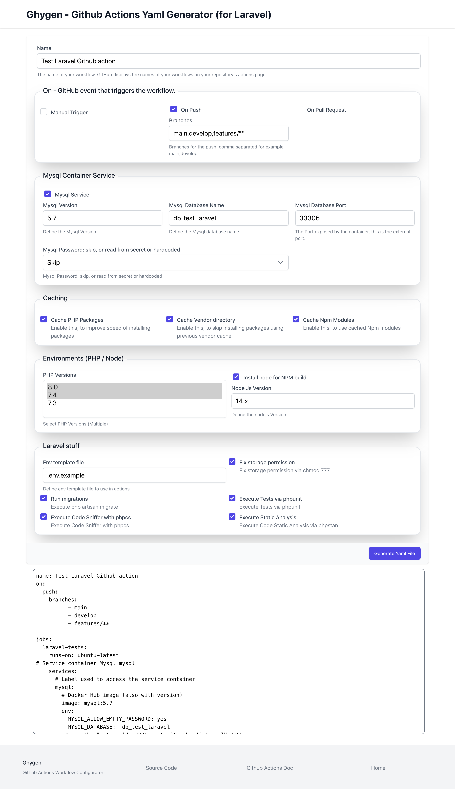

# Ghygen
__Ghygen__ is a GitHub actions Yaml Generator.

__Ghygen__ allows you creating your __Yaml__ file for __GitHub Actions__, for Laravel/PHP web application,  so you can:

- select triggering events: manually or automatically, when the developer _push_ the code on a specific branch, or a developer create a new _Pull Request_;
- select branches;
- enable caching for all vendors;
- enable __caching__ PHP packages;
- select __multiple__ PHP versions (8.0, 7.4, 7.3);
- select __multiple Laravel__ versions (8, 7, 6), useful if you are developing a Laravel Package and you want to test it with multiple Laravel version;
- select __Node__ version for NPM (npm run something);
- caching node packages;
- setup __Mysql__ Database service;
- setup __PostgreSQL__ Database service;
- setup __Sqlite__ in memory database;
- run migrations;
- __execute tests__ via phpunit;
- __execute tests__ via PestPHP;
- static __code analysis__ with phpstan or psalm;
- create Sarif report (with Psalm) for __GitHub integration with code scanning__;
- code sniffer (via phpcs for __PSR12__ compatibility);
- __validate Yaml__ file;
- execute __Browser Test__ via Laravel Dusk.
- Run __Deployments__ via Ploi using [Ploi Deploy Action](https://github.com/Glennmen/ploi-deploy-action).

This is a Work In Progress, we are adding new features...

If you want to test and use quickly this tool, I deployed the codebase (main branch) on Digital Ocean Platform:

- [Ghygen Demo](https://ghygen.hi-folks.dev/).

If you want to start using it locally you can clone the repo and install it following the instructions below.

## Command line
Experimental and "magical" feature: Ghygen ships also a command for generating **automatically** a GitHub Actions workflow Yaml file.
You can install Gygen as project with composer:
```shell
composer create-project hi-folks/ghygen
cd ghygen
```
Once you installed Ghygen, you can execute:
```shell
php artisan ghygen:generate --projectdir=../otherproject
```
Where "../otherproject" is the directory (absolute or relative path name) with your Laravel project (application or package) that yuo want to automatically generate the GitHub Actions workflow yaml file.
This "magic" command, will extract information from:
- composer.json
- package.json (if it exists)
- .env file
- ... and other assets
- in order to guess a configuration for your GitHub Actions workflow.

By default the command will show the Yaml workflow file in the standard output. If you want to save it in a file for example "my-workflow.yml" you can use --save option:
```shell
php artisan ghygen:generate  --save=my-workflow.yml
```

If you want to autogenerate Yaml file in the .github/workflows directory use --save=auto
```shell
php artisan ghygen:generate  --save=auto
```
The file name will be created with the name found in composer.json (slugified).

So if you are *superlazy* and want to generate the workflow for the project in the directory ../myproject , you can execute:
```shell
php artisan ghygen:generate --projectdir=../myproject/ --save=auto
```


## Install
Clone source code, enter the new directory and perform a couple of instructions:
```shell
git clone https://github.com/Hi-Folks/gh-actions-yaml-generator.git
cd gh-actions-yaml-generator
make install
```
Then create your database and update the .env file with the right values for DB_* .

Once your Database is configured you can execute the migrations:
```shell
php artisan migrate
```
Start development server
```shell
php artisan serve
```
Open the browser to the URL: http://127.0.0.1:8000

## Usage
Follow these steps:
- access to the form (by default the URL is http://127.0.0.1:8000 if you run php artisan serve);
- fill the form;
- click on "Generate Yaml File" button.



Next, copy the content of your generated Yaml in a new file in your Laravel project _.github/workflows/laravel_workflow.yaml_ .

Commit and push the new file.

If you configured "On - Push" you will see the running Actions in your Actions section of your GitHub project.
