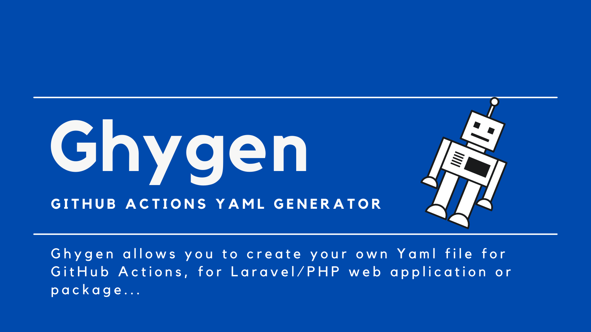

# Ghygen
__Ghygen__ is a GitHub actions Yaml Generator.

__Ghygen__ allows you creating your __Yaml__ file for __GitHub Actions__, for Laravel/PHP web application,  so you can:

- select triggering events: manually or automatically, when the developer _push_ the code on a specific branch, or a developer create a new _Pull Request_;
- select branches;
- enable caching for all vendors;
- enable caching PHP packages;
- select multiple PHP versions (8.0, 7.4, 7.3);
- select Node version for NPM (npm run something);
- caching node packages;
- setup Mysql service;
- run migrations;
- execute tests via phpunit;
- static code analysis; 
- code sniffer (via phpcs);
- validate Yaml file;
- execute Browser Test via Laravel Dusk.

This is a Work In Progress, we are adding new features...

If you want to test and use quickly this tool, I deployed the codebase (main branch) on Digital Ocean App Platform:

- [Ghygen Demo](https://ghygen-5proe.ondigitalocean.app/).

If you want to start using it locally you can clone the repo and install it following the instructions below.

## Install
Clone source code, enter the new directory and perform a couple of instructions:
```shell
git clone https://github.com/Hi-Folks/gh-actions-yaml-generator.git
cd gh-actions-yaml-generator
cp .env.example .env
composer install
php artisan key:generate
```
Start development server
```shell
php artisan serve
```
Open the browser to the URL: http://127.0.0.1:8000

## Usage
Follow these steps:
- access to the form (by default the URL is http://127.0.0.1:8000 if you run php artisan serve);
- fill the form;
- click on "Generate Yaml File" button.


Next, copy the content of your generated Yaml in a new file in your Laravel project _.github/workflows/laravel_workflow.yaml_ .

Commit and push the new file.

If you configured "On - Push" you will see the running Actions in your Actions section of your GitHub project.
